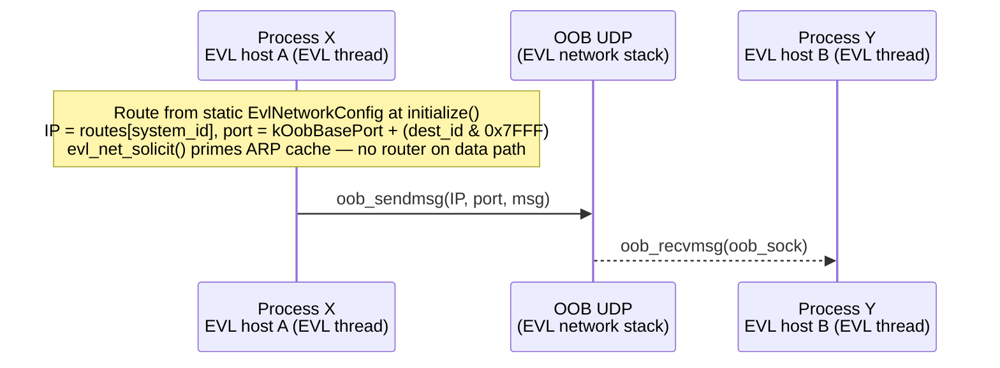
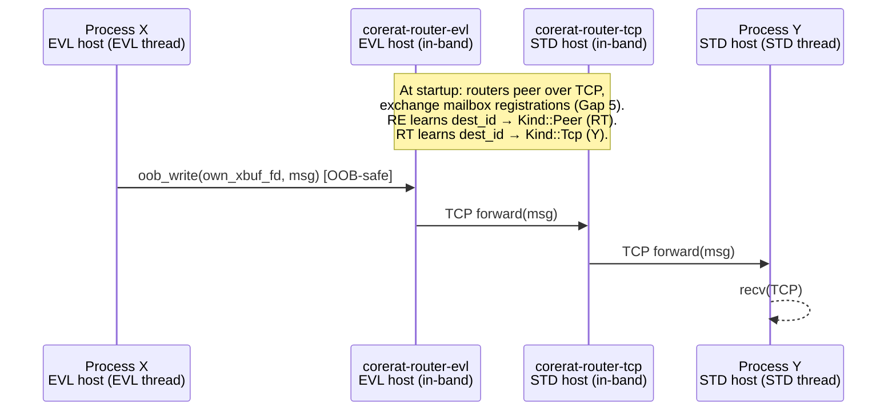
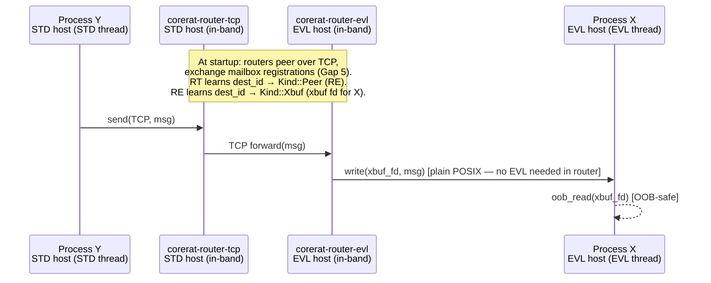
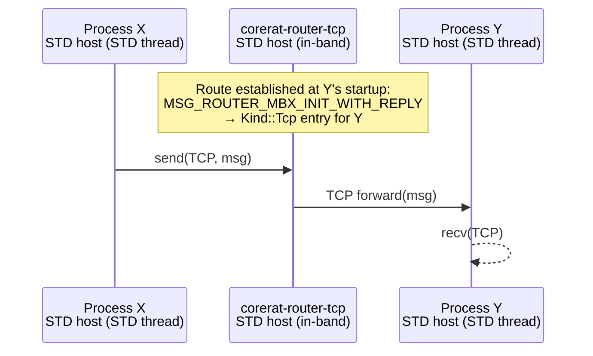
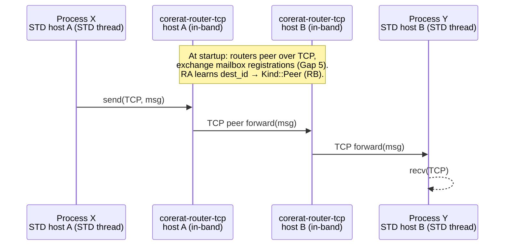
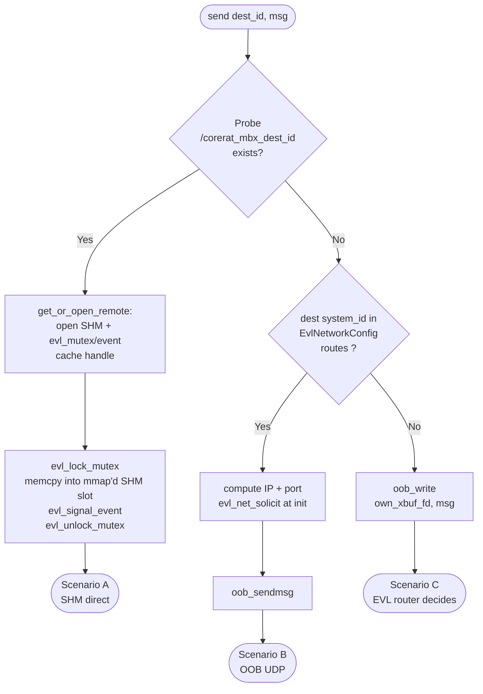
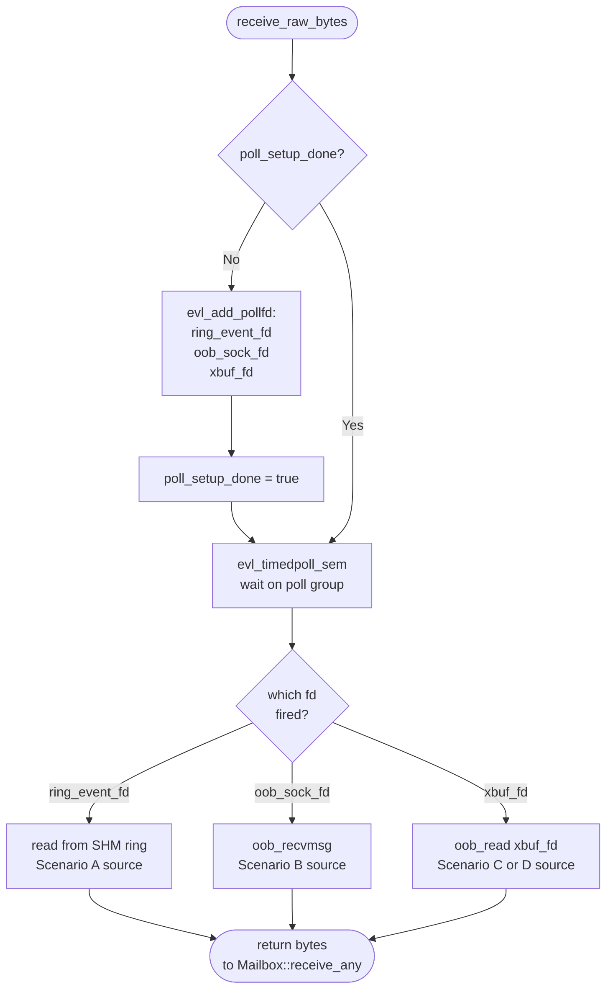
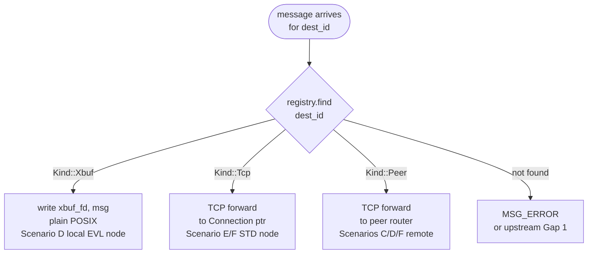

# CoreRaT / RACK Interoperability Gaps

**Purpose**: Track every known difference between CoreRaT's IPC/routing model and the original
RACK/TiMS architecture, and document the agreed design for closing each gap.

This document is a working list — update it as gaps are closed or new ones are found.

---

## Proposed Architecture

### Core principle (matching RACK)

Components never choose a transport. They call `mailbox.start()` and `mailbox.send()`.
The router daemon selects the delivery mechanism based on what it knows about the
destination mailbox. This is transparent to application code regardless of whether
the destination is EVL or STD, local or remote.

### Why not a kernel module?

The original TiMS was a kernel module (Xenomai 2/3) because that was the only way to
reach RT threads from non-RT code. EVL 4 adds `xbuf` (cross-buffer) as a user-space
primitive specifically designed for this purpose. CoreRaT stays entirely in user space:
safer, restartable, no kernel build dependency, no signed-module requirement.

### Daemons — matching RACK's model

In RACK, RT hosts ran the TiMS kernel module router and non-RT hosts ran `TimsRouterTcp`.
Both spoke the same wire protocol to each other for inter-host forwarding. CoreRaT follows
the same topology, replacing the kernel module with the EVL user-space router:

| Daemon | Runs on | EVL dependency | Role |
|--------|---------|----------------|------|
| `corerat-router-evl` | **EVL hosts only** | Yes (links libevl) | Full message router for EVL nodes: handles registration, xbuf bridging (OOB↔in-band), inter-router TCP forwarding. Replaces the TiMS kernel module. |
| `corerat-router-tcp` | **STD hosts only** | None | Pure TCP message router for STD nodes: handles registration and forwarding. Connects to `corerat-router-evl` on remote EVL hosts for cross-host delivery. Replaces `TimsRouterTcp`. |

**How components connect:**
- EVL nodes (`CORERAT_IPC_EVL`) → connect to local `corerat-router-evl` (port 2000).
- STD nodes (`CORERAT_IPC_TIMS`) → connect to local `corerat-router-tcp` (port 2000).
- Routers connect to each other over TCP for cross-host forwarding (same port or dedicated inter-router port — TBD, see Open Questions).

**Operational rule:** on an EVL host, start `corerat-router-evl` before any EVL node.
On a STD host, start `corerat-router-tcp` before any STD node. Stop order is reverse.
No configuration is required in application code — components find their local router
by convention (localhost:2000).

**Key consequence:** `corerat-router-tcp` never needs to link against libevl.
`corerat-router-evl` already links against libevl (it uses `evl_create_xbuf` to open
xbuf fds for each registered EVL mailbox). This is the correct separation of concerns.

### xbuf — the EVL primitive for OOB ↔ in-band crossing

`evl_create_xbuf` creates a kernel-managed ring pair connecting the two execution stages:

```
EVL thread (OOB stage)          xbuf (kernel ring pair)        in-band thread / router
  oob_write(xbuf_fd, msg) ──► [──── outbound ring ────] ──►  read(xbuf_fd, msg)
  oob_read(xbuf_fd, msg)  ◄── [──── inbound ring  ────] ◄──  write(xbuf_fd, msg)
```

Key properties (from the EVL function index):
- `evl_create_xbuf()` — strict in-band call (▼), callable by non-EVL threads (✔). Created at `EvlMailbox::initialize()` before any OOB activity.
- `oob_write()` / `oob_read()` — strict OOB calls (▲), not available to non-EVL threads (⛔). Used only inside `EvlMailbox::send()` / `receive_raw_bytes()`.
- Plain `write(2)` / `read(2)` / `poll(2)` on the xbuf fd — standard POSIX, usable by the router's in-band threads with zero EVL involvement.
- `EVL_CLONE_PUBLIC` makes the xbuf appear at `/dev/evl/xbuf/corerat-xbuf-<mailbox_id>` so any process (including the router) can open it by name.

This is **why `evl_signal_event()` and `evl_lock_mutex()` cannot be used by the bridge**: both are ⛔ for non-EVL threads. The router cannot write into the SHM ring directly. `write(xbuf_fd)` is the only correct and OOB-safe path for an in-band process to deliver data to an EVL thread.

### How registration works (transparent to the application)

**EVL node** — inside `EvlMailbox::initialize()` (in-band, before first OOB operation):
1. Creates a PUBLIC `evl_mutex` + `evl_event` + SHM ring (existing).
2. **New**: creates a PUBLIC xbuf: `evl_create_xbuf(cap, cap, EVL_CLONE_PUBLIC, "corerat-xbuf-%u", mailbox_id)`.
3. Connects TCP socket to **local `corerat-router-evl`** on port 2000.
4. Sends `MSG_ROUTER_MBX_INIT_WITH_REPLY`.
5. EVL router receives the registration, opens `/dev/evl/xbuf/corerat-xbuf-<id>`, stores entry as `Kind::Xbuf`.
6. EVL router starts a bridge-read thread: `poll(xbuf_fd, POLLIN)` → `read(xbuf_fd)` → route to destination.

**STD node** — inside `TimsMailbox::initialize()` (existing behaviour, unchanged):
1. Connects TCP socket to **local `corerat-router-tcp`** on port 2000.
2. Sends `MSG_ROUTER_MBX_INIT_WITH_REPLY`.
3. TCP router stores entry as `Kind::Tcp`.

**Inter-router connection** (cross-host and cross-type routing):
- At startup, each router connects to configured peer routers (other hosts, other types).
- Peer routers advertise their registered mailboxes to each other (Gap 5 — protocol TBD).
- When a message arrives for an unknown local mailbox, it is forwarded to the peer that
  owns that mailbox_id.

**Unregistration** — `MSG_ROUTER_MBX_DELETE` (existing protocol, unchanged for both node types).

The application calls `mailbox.start()` → done. No xbuf, OOB, TCP, or inter-router
details are visible to any component.

### Router registries and routing decisions

```
corerat-router-evl  MailboxRegistry          corerat-router-tcp  MailboxRegistry
  (on EVL host)                                (on STD host)
  ┌──────────────────────────────────┐         ┌──────────────────────────────────┐
  │  mailbox_id │ Kind  │ handle     │         │  mailbox_id │ Kind  │ handle     │
  │─────────────┼───────┼────────────│         │─────────────┼───────┼────────────│
  │  0x01010100 │ Xbuf  │ xbuf fd    │◄──────► │  0x02010100 │ Tcp   │ Connection*│
  │  0x01010200 │ Xbuf  │ xbuf fd    │  TCP    │  0x02010200 │ Tcp   │ Connection*│
  │  0x02xxxxxx │ Peer  │ TCP conn → │──────►  │  0x01xxxxxx │ Peer  │ TCP conn → │
  └──────────────────────────────────┘         └──────────────────────────────────┘
                 ↑                                              ↑
      EVL nodes connect here                        STD nodes connect here
      (TCP socket, port 2000)                       (TCP socket, port 2000)

EVL router routing decision:             TCP router routing decision:
  Kind::Xbuf  → write(xbuf_fd, bytes)     Kind::Tcp  → forward over TCP connection
  Kind::Peer  → forward over TCP to peer  Kind::Peer → forward over TCP to peer
  not found   → error / upstream (Gap 1)  not found  → error / upstream (Gap 1)
```

### Assumptions

- **A host is either EVL or STD — never both.** EVL and STD nodes never share a host.
- **Each CommRaT module is a separate OS process.** Same-process (intra-process) communication
  is only used in unit tests, not in real deployments. It is excluded from this matrix.
- All routing is **fully automatic** — no application code is involved on any path.
  The application calls `mailbox.start()` and `mailbox.send()`. Everything else is handled
  by the router daemon and the IPC backend.

### Valid communication scenarios

Only 6 combinations of (source type, destination type, location) are possible:

| ID | Source | Destination | Location | Status |
|----|--------|-------------|----------|--------|
| A | EVL | EVL | Same host (different processes) | ✅ Implemented |
| B | EVL | EVL | Remote host | ✅ Implemented |
| C | EVL | STD | Always remote (host types differ → different hosts) | ✅ Fully implemented (`fbe23e1` + `53f884f`) |
| D | STD | EVL | Always remote | ✅ Fully implemented (`fbe23e1` + `53f884f`) |
| E | STD | STD | Same host (different processes) | ✅ Implemented |
| F | STD | STD | Remote host | ❌ Gap 1 + Gap 5 needed |

EVL→STD same-host and STD→EVL same-host are **impossible** — a host runs either
`corerat-router-evl` or `corerat-router-tcp`, never both.

### Scenario A — EVL → EVL, same host (cross-process)

```mermaid
sequenceDiagram
    participant X as Process X<br/>(EVL thread)
    participant SHM as POSIX SHM ring<br/>evl_mutex / evl_event
    participant Y as Process Y<br/>(EVL thread)

    note over X,Y: Route established on first send — no router involved
    X->>SHM: open /corerat_mbx_&lt;dest_id&gt;<br/>evl_open_mutex / evl_open_event<br/>(cached after first send)
    X->>SHM: evl_lock_mutex → memcpy → evl_signal_event → evl_unlock_mutex
    SHM-->>Y: evl_timedwait_event → read slot from own ring
```

| Step | Who | What |
|------|-----|------|
| **Route established** | Sender, on first `send()` | Opens dest SHM + EVL objects by **deterministic name** derived from `dest_mailbox_id` — `/corerat_mbx_<id>`, `corerat-ring-mtx-<id>`, `corerat-ring-evt-<id>`. No router lookup. Handle cached for subsequent sends. |
| **Send** | EVL sender thread | `evl_lock_mutex` + `memcpy` into dest SHM + `evl_signal_event` — all OOB-safe |
| **Transport** | Direct POSIX SHM | No router, no network, no TCP |
| **Receive** | EVL receiver thread | `evl_timedwait_event` → read from own SHM ring — OOB-safe |
| **EVL demotion** | Neither thread | ✅ Both stay OOB throughout |
| **Implemented** | ✅ Yes (existing Public mode) | |

### Scenario B — EVL → EVL, remote host



| Step | Who | What |
|------|-----|------|
| **Route established** | Sender, at `initialize()` | Static `EvlNetworkConfig::routes[]` in `MailboxConfig`. `system_id` = `dest_id[31:24]`. Port = `kOobBasePort + (dest_id & 0x7FFF)`. `evl_net_solicit()` primes EVL ARP/route caches. |
| **Send** | EVL sender thread | `oob_sendmsg()` on OOB UDP socket — OOB-safe |
| **Transport** | OOB UDP — EVL network stack | Router **not on data path**. RT end-to-end if NIC driver is OOB-capable. Matches RACK/RTnet: RT-to-RT bypasses the TiMS router on the data path. |
| **Receive** | EVL receiver thread | `oob_recvmsg()` on OOB UDP socket — OOB-safe |
| **EVL demotion** | Neither thread | ✅ Both stay OOB throughout |
| **Implemented** | ✅ Yes (existing Network mode) | |

### Scenario C — EVL → STD, remote host



| Step | Who | What |
|------|-----|------|
| **Route established** | Routers, at startup | EVL router and STD router connect and exchange mailbox registrations (Gap 5). EVL router: `dest_id → Kind::Peer` pointing to STD router. STD router: `dest_id → Kind::Tcp` pointing to Y. |
| **Send** | EVL sender thread | `oob_write(own_xbuf_fd, msg)` — OOB-safe. Sender always hands off to its local EVL router; router decides the onward path (OQ-2). |
| **Transport** | xbuf outbound ring → TCP → TCP | EVL router: `read(xbuf_fd)` → TCP to STD router → TCP to dest node |
| **Receive** | STD receiver thread | `recv()` on TCP socket — existing `TimsMailbox::receive_raw()` |
| **EVL demotion** | Sender only | ✅ `oob_write` is OOB-safe. STD receiver is in-band by nature. |
| **Implemented** | ✅ Fully implemented (`fbe23e1` + `53f884f`) — EVL send via `oob_write(xbuf_fd_)`, EVL router xbuf→TCP, inter-router peering carries the message to the STD router, TCP→STD node | |

### Scenario D — STD → EVL, remote host



| Step | Who | What |
|------|-----|------|
| **Route established** | Routers, at startup | STD router: `dest_id → Kind::Peer` (EVL router). EVL router opened xbuf fd for X at registration: `dest_id → Kind::Xbuf`. |
| **Send** | STD sender thread | `send()` on TCP to local STD router — existing `TimsMailbox::send_raw()` |
| **Transport** | TCP → TCP → xbuf inbound ring | EVL router does a plain `write(xbuf_fd)` — no EVL attachment needed in the router thread |
| **Receive** | EVL receiver thread | `oob_read(xbuf_fd)` — OOB-safe |
| **EVL demotion** | Receiver only | ✅ `oob_read` is OOB-safe |
| **Implemented** | ✅ Fully implemented (`fbe23e1` + `53f884f`) — STD send via TCP, STD router peer-forwards to EVL router, `write(xbuf_fd)`, EVL `oob_read(xbuf_fd_)` | |

### Scenario E — STD → STD, same host



| Step | Who | What |
|------|-----|------|
| **Route established** | STD router, at Y's registration | Y sent `MSG_ROUTER_MBX_INIT_WITH_REPLY` at startup. Router stores `Kind::Tcp → Connection*` for Y. |
| **Send** | STD sender thread | `send()` on TCP to local router — existing |
| **Transport** | TCP → router → TCP | Both connections local to the same router process |
| **Receive** | STD receiver thread | `recv()` on TCP — existing |
| **EVL demotion** | N/A | |
| **Implemented** | ✅ Yes (existing) | |

### Scenario F — STD → STD, remote host



| Step | Who | What |
|------|-----|------|
| **Route established** | Router A, via peer advertisement | At startup, routers A and B connect and exchange registrations (Gap 5). A learns `dest_id → Kind::Peer` (router B). |
| **Send** | STD sender thread | `send()` on TCP to local router — existing |
| **Transport** | TCP → router A → TCP → router B → TCP | Two router hops |
| **Receive** | STD receiver thread | `recv()` on TCP — existing |
| **EVL demotion** | N/A | |
| **Implemented** | ❌ No — requires Gap 1/5 (inter-router peering + mailbox advertisement) | |

### Routing decision flow — who decides what and when

#### Send-side decision — `EvlMailbox::send_raw()` in the sender process

When an EVL module calls `mailbox.send(msg, dest_id)`, the sender works through a
priority chain **without asking the router**:



For **STD senders** (`TimsMailbox::send_raw()`): always TCP to local router. No
probe, no decision. The router holds the full registry.

#### Receive-side — no decision: `evl_poll` on all sources simultaneously

The receiver never decides which path to listen on. On first `receive_raw_bytes()`
call (from OOB context), the EVL thread registers all possible sources in an
`evl_poll` group and then blocks on whichever fires first:



The application sees a single `receive_any(visitor)` call that unifies all three
sources — identical to how RACK's TiMS presented one `tims_recvmsg()` regardless
of whether data came from local memcpy, RTnet, or TCP.

#### Router-side — registry built at registration, consulted at routing time



The registry is built entirely at **registration time** (`MSG_ROUTER_MBX_INIT_WITH_REPLY`
+ xbuf probe for EVL nodes, peer advertisement for remote mailboxes). No per-message
lookup beyond the registry is needed on the hot path.

#### Decision summary table

| Decision | Made by | When | Basis |
|---|---|---|---|
| Same-host EVL→EVL via SHM? | Sender `send_raw()` | First send to that dest | Probe `/corerat_mbx_<id>` by deterministic name |
| Remote EVL→EVL via OOB UDP? | Sender `send_raw()` | First send to that dest | Static `EvlNetworkConfig::routes[]` in `MailboxConfig` |
| EVL→unknown/STD via xbuf? | Sender `send_raw()` | Every send (fallthrough) | Neither probe succeeded nor OOB route exists |
| Which TCP connection for STD? | EVL/STD router registry | At routing time | `Kind::Tcp` entry set at dest registration |
| Which xbuf fd for EVL dest? | EVL router registry | At routing time | `Kind::Xbuf` entry opened at dest registration |
| Which peer router to forward to? | Router registry (Gap 5) | At routing time | `Kind::Peer` entry set at router peering startup |
| Which source to read from? | Nobody — `evl_poll` | At receive time | First ready fd in poll group wins |

#### Comparison with TIMS

TIMS and CoreRaT follow the **same conceptual decision structure** — the difference
is where the code runs (kernel vs user space):

| Aspect | TIMS (Xenomai 2/3) | CoreRaT (EVL 4) |
|--------|-------------------|-----------------|
| **Same-host fast path** | Kernel module: direct memcpy into dest mailbox buffer in kernel space, wake waiter via RT semaphore | Sender: `evl_lock_mutex` → `memcpy` into mmap'd POSIX SHM → `evl_signal_event`. Equivalent — both bypass the router, both are pure memory writes with RT-safe synchronization |
| **RT-to-RT remote** | RTnet: kernel-level real-time Ethernet stack, router not on data path | OOB UDP: `oob_sendmsg` / `oob_recvmsg`, router not on data path. Equivalent |
| **RT↔non-RT bridge** | TiMS kernel module held both RTnet and TCP handles and bridged internally | EVL router: `write(xbuf_fd)` bridges OOB to in-band. Same responsibility, different primitive |
| **Who decides route** | TiMS kernel module checked local mailbox table, then RTnet, then TCP — priority chain in kernel | `EvlMailbox::send_raw()` probes SHM name, checks static route table, falls through to xbuf — same priority chain in user space |
| **Single receive call** | `tims_recvmsg()` unified local, RTnet, TCP in kernel | `evl_poll` on ring_event + oob_sock + xbuf — same unification in user space |
| **Route discovery** | RTnet used ARP-like dynamic discovery for RT peers | CoreRaT B uses static `EvlNetworkConfig::routes[]` — **no dynamic discovery yet** (potential future gap) |
| **Router registration protocol** | TiMS router protocol over RTnet/TCP — same wire format for both | CoreRaT uses same TiMS TCP wire protocol for both router types (port 2000) |
| **Router hierarchy** | Three tiers (Router → System Router → Top Level) | Currently flat — Gap 1 |

The key architectural insight is identical in both systems: **the router is never on
the hot path for same-host or RT-to-RT communication.** It only participates in
registration and bridging. RACK's paper states this explicitly for RTnet; CoreRaT
preserves it for both SHM (Scenario A) and OOB UDP (Scenario B).

### Multiple subscribers — CoreRaT vs CommRaT responsibility

**CoreRaT IPC is point-to-point.** Every `send(msg, dest_mailbox_id)` delivers to exactly
one destination mailbox. There is no fan-out at the IPC layer.

**Multiple subscribers are CommRaT's responsibility**, matching RACK exactly:
- In RACK, `getContData()` added a recipient to the data module's **listener list**.
  The data task called `send()` once per listener on each cycle.
- In CommRaT, the module layer maintains the same listener list and calls
  `mailbox.send()` once per subscriber.

This means all six scenarios above describe a **single send → single receive**.
Fan-out from one producer to N subscribers is N separate `send()` calls, each
following one of the six scenarios depending on where each subscriber lives.

**There is one exception worth noting for scenario B:** EVL OOB UDP supports
multicast (`oob_sendmsg` to a multicast group address). If all subscribers are
EVL nodes on the same network segment, CommRaT could use a multicast mailbox
address to deliver to all of them in one `oob_sendmsg`. This is not currently
designed but is technically available from the EVL networking stack. Recorded
as a future consideration; no action needed now.

### OOB-safety summary

**Why POSIX SHM does not break real-time (Scenario A):**

POSIX SHM is just memory. `shm_open` + `mmap` happen once at `initialize()` time
(in-band). After that, the SHM region is already mapped into both processes' virtual
address space. Hot-path access is a plain `memcpy` — no syscall, no kernel
involvement, fully deterministic.

The RT-safety of the same-host path comes entirely from the **synchronization**
around the memory, not the memory itself. `evl_lock_mutex` (▲ OOB-safe),
`memcpy` (pure memory write), `evl_signal_event` (🟰 OOB-safe), `evl_unlock_mutex`
(🟰 OOB-safe) — none of these demote the thread.

**The one real RT risk is page faults.** If a SHM page has not yet been faulted
in when the OOB thread writes to it, the kernel would demote the thread to handle
the fault in-band. This is mitigated by **`mlockall(MCL_CURRENT | MCL_FUTURE)`**
called at process startup, which locks all current and future mapped pages into RAM.
This is mandatory for any EVL RT process and must be called before `evl_attach_self()`.
After `mlockall`, SHM pages are guaranteed resident and `memcpy` never faults.

There is no EVL-specific "shared memory" primitive. EVL's design deliberately
delegates memory management to the OS (POSIX SHM or heap) and provides only
**synchronization** primitives (`evl_mutex`, `evl_event`) for OOB safety. Using
POSIX SHM + EVL sync is the intended pattern, not a workaround.

| Scenario | EVL send calls | EVL receive calls | Demotes to in-band? |
|----------|----------------|-------------------|---------------------|
| A (EVL→EVL same host) | `evl_lock_mutex` → `memcpy` into mmap'd SHM → `evl_signal_event` → `evl_unlock_mutex` | `evl_timedwait_event` → `memcpy` from mmap'd SHM | ✅ Never (requires `mlockall`) |
| B (EVL→EVL remote) | `oob_sendmsg` | `oob_recvmsg` | ✅ Never |
| C (EVL→STD remote) | `oob_write(xbuf_fd)` | N/A (STD receiver is in-band) | ✅ Never (sender) |
| D (STD→EVL remote) | N/A (STD sender is in-band) | `oob_read(xbuf_fd)` | ✅ Never (receiver) |

### Implementation status

| Scenario | Status | Blocking gaps |
|----------|--------|---------------|
| A | ✅ Implemented | — |
| B | ✅ Implemented | — |
| C | ✅ Implemented (`fbe23e1` + `53f884f`) | — |
| D | ✅ Implemented (`fbe23e1` + `53f884f`) | — |
| E | ✅ Implemented | — |
| F | ❌ Not implemented | Gap 1 (hierarchical routing) |

### Why no kernel module

The EVL kernel API (`/core/kernel-api/`) is for writing OOB-capable NIC drivers. CoreRaT
needs none of it. End-to-end RT latency for scenario B depends on whether the target NIC
driver is OOB-capable — a BSP/hardware concern, outside CoreRaT scope.

---

## Background: RACK/TiMS Routing Model (from paper)

```
Top Level Router            ← knows all mailboxes across all systems
  ├── System Router (Sys 1) ← knows all mailboxes on System 1's hosts
  │     ├── Router (Host 1) ← knows all local mailboxes on Host 1
  │     └── Router (Host 2)
  └── System Router (Sys 3)
        └── Router (Host 5)
```

**Key properties:**
- A single messaging layer (TiMS) handles **all** components — real-time (RTnet) and
  non-real-time (TCP/IP) — transparently.
- Components never choose a transport; TiMS + the router hierarchy selects it based on
  destination mailbox address.
- RT ↔ non-RT and local ↔ remote communication all work identically from the component's
  perspective.
- Cross-system addressing is encoded in the 32-bit mailbox address:
  `[system_id:8][class_id:8][instance_id:8][local_id:8]`
- Commands are positive message types, replies are negative (same magnitude, sign flipped).
- Every host runs exactly one TiMS router daemon. The daemon participates in the hierarchy
  by informing its super-router about locally registered mailboxes.

---

## Gap 1 — No Hierarchical Routing

**Severity**: High  
**Affects**: Cross-host and cross-system communication  
**Status**: Design agreed, not yet implemented

### RACK behaviour
Routers form a three-tier hierarchy (Router → System Router → Top Level Router).
When a component on Host 1 sends to a mailbox on Host 4, the local router forwards
the message up to the System Router, which forwards it to the correct host router,
which delivers locally. No component code changes are needed regardless of whether
the destination is local or remote.

### CoreRaT current state
`corerat-router-tcp` is a **flat, single-level router**. It maintains one `mailbox_id → Connection*`
table. If the destination is not registered locally, it sends `MSG_ERROR` back to the sender.
There is no forwarding to any higher-level router. Inter-host communication only works if all
nodes connect to the **same** router instance.

`corerat-router-evl` is a name-service only (see Gap 6).

### Agreed design
A **flat star topology** (all hosts connect to one central `corerat-router-tcp` instance) is
sufficient for single-robot systems and is the first milestone. RACK's full three-tier hierarchy
(Router → System Router → Top Level Router) is the long-term target for multi-robot fleets but
is not required before the xbuf bridge (Gap 2) is implemented.

For the flat star case, all nodes on all hosts connect to the same `corerat-router-tcp` port.
The router's `mailbox_id → Kind` table already supports any client type (TCP or Xbuf)
regardless of which host they are on. Cross-host delivery to STD nodes is just a TCP forward;
cross-host delivery to EVL nodes is a `write(xbuf_fd)` on the fd opened by the router at
registration time (the xbuf fd is valid cross-host because it was opened via `/dev/evl/xbuf/`
on the router's local host — this only works if the EVL node and the router are co-located,
which is always true by definition for path ③).

### Action items
- [ ] Add an optional `--upstream-router HOST:PORT` flag to `corerat-router-tcp` so it can
      forward unknown destinations to a configured upstream instance (matching RACK's
      Router → System Router link). Prerequisite for transport paths ④ ⑤ ⑦ in the matrix.
- [ ] Add `system_id` extraction from `mailbox_id[31:24]` so the router can select the
      correct upstream connection for cross-system (multi-robot) addressing (Gap 8).

---

## Gap 2 — No RT ↔ non-RT Interoperability

**Severity**: Critical  
**Affects**: Any system running both EVL and STD nodes  
**Status**: ✅ Fully implemented (`fbe23e1` + `53f884f`) — all six scenarios A–E complete; F pending Gap 1

### RACK behaviour
TiMS was a kernel module (Xenomai 2/3). It could reach RT threads from non-RT code via
kernel-level primitives. Components were completely unaware of the transport.

### CoreRaT current state
No bridge exists between `EvlMailbox` (OOB ring / OOB UDP) and `TimsMailbox` (TCP). EVL and
STD nodes cannot exchange messages at all.

### Agreed design — xbuf bridge in `corerat-router-evl` (no kernel module needed)

EVL 4 provides `evl_create_xbuf` specifically for this use case. The bridge is implemented
in `corerat-router-evl`, which already links libevl. `corerat-router-tcp` stays EVL-free.

**Changes to `EvlMailbox::initialize()`** (in-band phase, before `evl_attach_self()`):
```cpp
// Create PUBLIC xbuf — visible to router at /dev/evl/xbuf/corerat-xbuf-<id>
xbuf_fd_ = evl_create_xbuf(
    config_.max_msg_size * config_.message_slots,  // inbound ring (in-band → OOB)
    config_.max_msg_size * config_.message_slots,  // outbound ring (OOB → in-band)
    EVL_CLONE_PUBLIC,
    "corerat-xbuf-%u", config_.mailbox_id);
// Also connect to corerat-router-tcp and send MSG_ROUTER_MBX_INIT_WITH_REPLY
// (same as TimsMailbox — gives the router a TCP connection for control messages)
```

**Changes to `EvlMailbox::receive_raw_bytes()`** — poll both sources:
```cpp
// OOB-safe poll: wakes on ring_event_ (EVL-to-EVL) OR xbuf_fd_ (bridge)
// Uses evl_poll group set up at first OOB entry (evl_add_pollfd is ▲ OOB)
struct evl_poll_event events[2];
int n = evl_timedpoll_sem(poll_fd_, &abs_ts, events, 2);
for (int i = 0; i < n; i++) {
    if (events[i].fd == xbuf_fd_)      return oob_read(xbuf_fd_, buffer);
    if (events[i].fd == ring_event_fd_) // read from ring (existing)
}
```

**Changes to `EvlMailbox::send()`** — outbound path to non-EVL destinations:
```cpp
// If destination is registered with the router as TCP (STD node):
//   oob_write(xbuf_fd_, serialized_msg)  → router reads via read(xbuf_fd_) → TCP
// If destination is EVL same-process:    direct ring (existing)
// If destination is EVL cross-process:   router → write(dest_xbuf_fd) → oob_read
// If destination is EVL remote:          oob_sendmsg OOB UDP (existing)
```

**Changes to `corerat-router-evl` — registration handler** (EVL nodes connect here):
```cpp
// EVL nodes send MSG_ROUTER_MBX_INIT_WITH_REPLY just like STD nodes do to tcp router.
// After accepting the TCP control connection:
char path[80];
snprintf(path, sizeof(path), "/dev/evl/xbuf/corerat-xbuf-%u", mbx_id);
const int xfd = open(path, O_RDWR);  // node must have created this xbuf first
if (xfd < 0) { reply MSG_ERROR; return; }
registry_.add(mbx_id, Kind::Xbuf, xfd);
// Launch bridge-read thread: poll(xfd, POLLIN) → read() → route()
```

**Changes to `corerat-router-evl` — routing**:
```cpp
switch (entry.kind) {
    case Kind::Xbuf: write(entry.xbuf_fd, body, body_len); break;  // plain POSIX write
    case Kind::Peer: peer_connection->forward(hdr, body, body_len); break; // TCP to peer router
}
```

**`corerat-router-tcp` — no changes needed** for Gap 2. It gains only a `Kind::Peer`
entry pointing to the EVL router on remote EVL hosts (inter-router forwarding, Gap 5).

### Action items
- [x] Implement xbuf creation in `EvlMailbox::initialize()` (`mlockall` + `create_xbuf()` helper, commit `fbe23e1`).
- [x] Implement dual-source poll in `EvlMailbox::receive_raw_bytes()` (ring_event + xbuf via `evl_timedpoll` on `poll_fd_`, commit `fbe23e1`).
- [x] Implement outbound xbuf path in `EvlMailbox::send()` for non-EVL destinations (`oob_write(xbuf_fd_)` fallthrough in `send_raw()`, commit `fbe23e1`).
- [x] Upgrade `corerat-router-evl` from name-service to full message router (TCP accept loop, `Kind::Xbuf` registry, `XbufEntry` bridge-read thread, routing dispatch — commit `fbe23e1`).
- [ ] Add inter-router TCP peering to both routers (prerequisite for cross-host Scenarios C/D/F — see Gap 5).

---

## Gap 3 — Backend Selection Is Per-Binary, Not Per-Mailbox

**Severity**: Medium → **Resolved by Gap 2 design**  
**Affects**: Architecture flexibility; forces homogeneous builds  
**Status**: Closed by design — the xbuf bridge makes it moot

### Resolution
With the xbuf bridge in place, an EVL binary with `CORERAT_IPC_EVL` can receive from
both OOB sources (direct ring) and in-band sources (via xbuf) through the same
`receive_raw_bytes()` call. The router selects the delivery mechanism; the application
never knows. A non-RT GUI can always reach an EVL node by sending to the router,
which writes into the EVL node's xbuf. No per-mailbox backend selector is needed.

---

## Gap 4 — No Byte-Order Conversion

**Severity**: Low (homogeneous ARM/x86 LE systems; medium if big-endian ever needed)  
**Affects**: Cross-architecture interoperability  
**Status**: Mostly resolved — SeRTial provides the primitive

### RACK behaviour
The TiMS message header `flags` field encodes sender byte order. On receive, TiMS converts
all integer fields to local byte order if the sender used a different one.

### CoreRaT current state
`protocol.hpp` defines `FRAME_LE_FLAG = 0x03` and always sets it. The `receive_raw` path
reads fields directly without checking or converting byte order.

### Resolution — SeRTial provides `swap_endianness_from<T>()`

SeRTial (`sertial/core/endian.hpp`) provides exactly the needed primitive:

```cpp
// Receiver side — router or TimsMailbox::receive_raw():
auto buffer = receive_bytes();
const auto sender_endian = (frame.flags & FRAME_LE_FLAG)
    ? std::endian::little : std::endian::big;
sertial::swap_endianness_from<WireHeader>(buffer, sender_endian);
// then deserialize payload
```

**Constraints from SeRTial's implementation:**
- Works on serialized (packed) byte streams, not struct memory.
- Only works for fixed-size types. Payloads containing `fixed_vector` or `fixed_string`
  must handle endianness during deserialization, not on raw bytes.
- Both `WireHeader` (all `uint32_t`/`uint64_t`) and simple POD payloads are fully supported.

### Action items
- [x] SeRTial provides `swap_endianness_from<T>()` — no external dependency needed.
- [ ] Add byte-order check + `swap_endianness_from<WireHeader>` to `TimsMailbox::receive_raw()`.
- [ ] Add the same to the `corerat-router-evl` bridge-read path (messages from TCP peers).
- [ ] Document the `fixed_vector`/`fixed_string` limitation for payloads requiring big-endian support.

---

## Gap 5 — No Router Mailbox Advertisement (Router-to-Router Protocol)

**Severity**: Medium (prerequisite for Gap 1 fix)  
**Affects**: Multi-host routing  
**Status**: ✅ Implemented (commit `53f884f`)

### RACK behaviour
When a component registers a mailbox with its local TiMS router, the router informs its
super-router of the new mailbox. The super-router propagates upwards. Top-level routing
tables are therefore maintained automatically and dynamically.

### CoreRaT current state
`corerat-router-tcp` registers `mailbox_id → Connection*` locally. There is no protocol to
inform any other router instance about locally known mailboxes. `MSG_ROUTER_MBX_INIT_WITH_REPLY`
only exists between client and router.

### Action items
- [x] Design a router-to-router sub-protocol on top of the existing TCP connection
      for mailbox advertisement (`MSG_ROUTER_PEER_HELLO/REGISTER/DELETE`, types 20-22,
      commit `53f884f`).
- [x] Both routers support `--peer HOST[:PORT]` at startup — outbound connection,
      PEER_HELLO handshake, bidirectional PEER_REGISTER/DELETE exchange (`53f884f`).
- [x] Integration test: `test_router_peer` verifies A→B and B→A cross-router
      forwarding + PEER_DELETE propagation (`53f884f`).
- [ ] Gap 1 hierarchical routing (Router → System Router) still needed for
      multi-system (fleet) deployments.

---

## Gap 6 — EVL Router Must Be Upgraded to a Full Message Router

**Severity**: High (prerequisite for Gap 2)  
**Affects**: EVL cross-process routing and xbuf bridge  
**Status**: ✅ Implemented (commit `fbe23e1`)

### Current state
`corerat-router-evl` is a name-service (Unix domain socket): it maps `mailbox_id →
SHM path + EVL object names`. It never forwards messages.

### Required state (matching RACK's `TimsRouter`)
`corerat-router-evl` must become a **full TCP message router** that:
1. Accepts TCP connections from EVL nodes (same protocol as `corerat-router-tcp`).
2. At registration, opens the node's PUBLIC xbuf via `/dev/evl/xbuf/corerat-xbuf-<id>`
   and stores `Kind::Xbuf` entries — no SHM probe needed.
3. Routes inbound messages (from TCP peer routers or from xbuf outbound rings) to the
   correct local EVL node via `write(xbuf_fd)` (plain POSIX — no EVL attachment needed
   in the router thread itself).
4. Accepts TCP connections from peer routers (`corerat-router-tcp` on STD hosts, or other
   EVL routers on remote EVL hosts) and forwards unknown destinations to them.
5. The old Unix domain socket name-service protocol can be retired: xbuf names are
   deterministic, so no name lookup is needed.

**The EVL router does NOT need to be an EVL thread itself.** `write(xbuf_fd)` is a
plain in-band POSIX call — the router bridge threads are regular `std::jthread`
instances. Only `evl_create_xbuf` (called once per registered mailbox, in-band ▼)
requires that libevl is linked.

### Action items
- [x] Document that the current `corerat-router-evl` is a name-service only.
- [x] Rewrite `corerat-router-evl` as a TCP message router (reuses `Connection` / `MailboxRegistry` pattern from `corerat-router-tcp`, commit `fbe23e1`).
- [x] Add xbuf open logic at registration time (probes `/dev/evl/xbuf/corerat-xbuf-<id>` via `open(O_RDWR)` during `MSG_ROUTER_MBX_INIT_WITH_REPLY` handling, commit `fbe23e1`).
- [x] Add bridge-read thread per registered mailbox (`XbufEntry` owns a `std::jthread` that `poll`/`read`s the xbuf outbound ring, commit `fbe23e1`).
- [x] Retire the old Unix domain socket name-service protocol (replaced entirely by TiMS TCP on port 2000, commit `fbe23e1`).

---

## Gap 7 — Remote Handle Cache Limit (EVL Public Mode)

**Severity**: Low  
**Affects**: EVL Public mode with many peer mailboxes

### RACK behaviour
No equivalent fixed limit; the TiMS router handled any number of registered mailboxes.
Component-level receive only needed one connection to the router.

### CoreRaT current state
`EvlMailbox` caches up to `kMaxRemoteHandles = 16` open remote SHM handles.
If a single `EvlMailbox` instance needs to send to more than 16 distinct peer mailboxes,
`get_or_open_remote()` returns `nullptr` and the send fails silently.

### Action items
- [ ] Increase `kMaxRemoteHandles` or make it configurable via `MailboxConfig`.
- [ ] Consider an LRU eviction policy for the remote handle cache.

---

## Gap 8 — No Cross-System (Multi-Robot) Address Space

**Severity**: Low (single-robot deployments not affected)  
**Affects**: Multi-robot systems, matching RACK's system_id routing

### RACK behaviour
The top 8 bits of the 32-bit mailbox address are `system_id`. Multiple robot systems
(e.g. a fleet) can interoperate because the top-level router distinguishes messages
by system_id and forwards to the correct system router.

### CoreRaT current state
`MailboxConfig::local_system_id` and `EvlNetworkConfig::Route::system_id` exist in EVL
Network mode — so the field is preserved in the address and the routing logic extracts it.
However, `corerat-router-tcp` ignores the system_id entirely; it does a flat `mailbox_id`
lookup. There is no concept of forwarding to a different system based on system_id.

### Action items
- [ ] No immediate action needed for single-robot use.
- [ ] When Gap 1 is addressed (hierarchical routing), system_id-based inter-system
      forwarding should be part of the design.

---

## Gap 9 — No Publish/Subscribe at the IPC Layer

**Severity**: Low (by design — CommRaT owns this)  
**Affects**: Direct RACK ↔ CoreRaT component interoperability

### RACK behaviour
TiMS components can call `getContData()` to register as a subscriber on a data stream.
The data module maintains a listener list and pushes data to all subscribers at the
negotiated period. This is handled by RACK at the framework level.

### CoreRaT current state
CoreRaT provides point-to-point `send()` and `receive_any()` only. Publish/subscribe is
deliberately out of scope — it belongs to CommRaT's module layer.

### Consequence
A CoreRaT node cannot directly subscribe to a RACK data component's continuous data
stream without CommRaT wrapping it. One-shot polling (`getData()` equivalent) works fine
because it is just a request/reply message exchange.

### Action items
- [ ] No action for CoreRaT itself.
- [ ] Document the boundary: CommRaT implements pub/sub on top of CoreRaT point-to-point send.
- [ ] When interoperating with RACK nodes, CommRaT must implement `getContData` / `stopContData`
      as explicit message types in the `MessageRegistry`.

---

## Summary Table

| # | Gap | Severity | Status |
|---|-----|----------|--------|
| 1 | No hierarchical routing (flat TCP router only) | High | Design agreed; flat-star first, upstream peering next |
| 2 | No RT ↔ non-RT interoperability | **Critical** | **Design agreed (xbuf in EVL router); implementation pending** |
| 3 | Backend selected per-binary, not per-mailbox | Medium | **Closed** — resolved by Gap 2 xbuf design |
| 4 | No byte-order conversion on receive | Low | **Mostly resolved** — SeRTial `swap_endianness_from<T>()` available |
| 5 | No router mailbox advertisement protocol | Medium | Open (required for remote-host paths ④ ⑦) |
| 6 | EVL router is name-service only, must become full router | **High** | **Design agreed; major rewrite pending (prerequisite for Gap 2)** |
| 7 | Remote handle cache capped at 16 (EVL Public mode) | Low | Open |
| 8 | No cross-system (system_id) routing in TCP router | Low | Open (design with Gap 1) |
| 9 | No pub/sub at IPC layer (by design) | Low | Closed (CommRaT concern) |

---

## Open Questions

These are recorded for later decision. No implementation should start until each relevant
question is answered.

### OQ-1 — xbuf poll group initialisation timing
`evl_add_pollfd()` is a strict OOB call (▲) so it cannot be called in `initialize()` (in-band).
It must be deferred to the first `receive_raw_bytes()` call on the EVL thread.
**Question**: Is there a use case where `receive_raw_bytes()` is never called from the EVL
thread itself (e.g., polled from a separate non-EVL monitor thread)? If so, the poll group
setup needs a different trigger point.

### OQ-2 — EVL outbound routing: how does the sender pick the transport?
For an EVL node sending to a STD node, it must use `oob_write(xbuf_fd)` (into its own
outbound xbuf ring for the router to read). For EVL-to-EVL cross-process, it should write
directly into the peer's xbuf. How does the sender know which path to take?
- **Option A — router informs sender**: router replies to `MSG_ROUTER_MBX_INIT_WITH_REPLY`
  with a transport hint for each known mailbox (EVL or TCP). Sender caches it.
- **Option B — sender always uses outbound xbuf to router**: router makes all decisions.
  One extra hop for EVL-to-EVL cross-process, but matches RACK's model exactly — the
  component never reasons about transport.
- **Option C — sender probes at first send**: tries `open("/dev/evl/xbuf/corerat-xbuf-<dest>")`,
  uses direct xbuf if found, falls back to router outbound xbuf.

**Recommendation**: Option B for correctness and simplicity. Decide before implementing Gap 2.

### OQ-3 — Inter-router port and protocol
When `corerat-router-evl` and `corerat-router-tcp` connect to each other, do they:
- Share port 2000 with a special registration message that identifies a peer router vs a node?
- Use a separate dedicated inter-router port (e.g., 2001)?
- Use the existing `MSG_ROUTER_MBX_INIT_WITH_REPLY` protocol for advertising mailboxes, or
  a new batch-advertisement message?

**TIMS reference**: if the original RACK `TimsRouter` or `TimsRouterTcp` source is available,
it would answer this exactly. Please share if available.

### OQ-4 — Same-host EVL ↔ STD path efficiency
With the two-router model, same-host EVL-to-STD goes:
`oob_write(xbuf)` → EVL router → loopback TCP → STD router → TCP to STD node.
The loopback TCP hop is fast but still involves two copies and a socket. Is this acceptable,
or should the EVL router be able to deliver directly to a STD node's TCP connection on the
same host (requiring the two routers to share a mailbox registry)?

### OQ-5 — `corerat-router-evl` Unix socket protocol
Should the old Unix domain socket name-service in `corerat-router-evl` be kept for
backward compatibility with any tooling that probes it, or retired immediately when the TCP
router mode is added?

### OQ-6 — Endianness of `WireHeader` fields in the router
The router currently forwards `FrameHeader` + body bytes verbatim without any byte-swap.
With Gap 4 addressed, the router needs to either:
- Swap `WireHeader` fields when forwarding between nodes of different endianness, or
- Leave it to the receiving node's `receive_raw_bytes()` to detect and convert.
The latter is simpler and matches how RACK's TCP router worked (the kernel module did
conversion, the TCP router forwarded verbatim).
